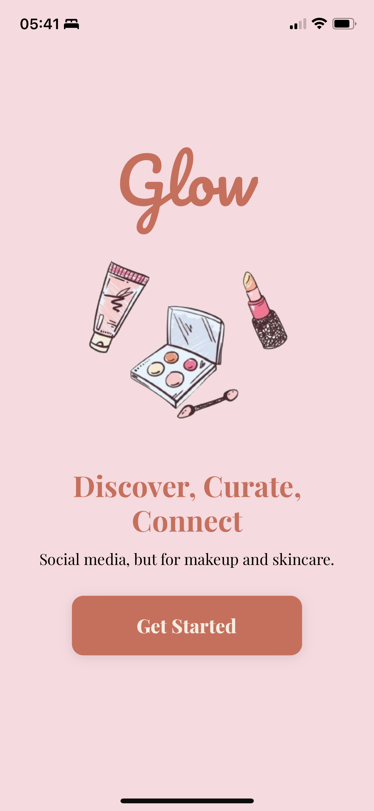
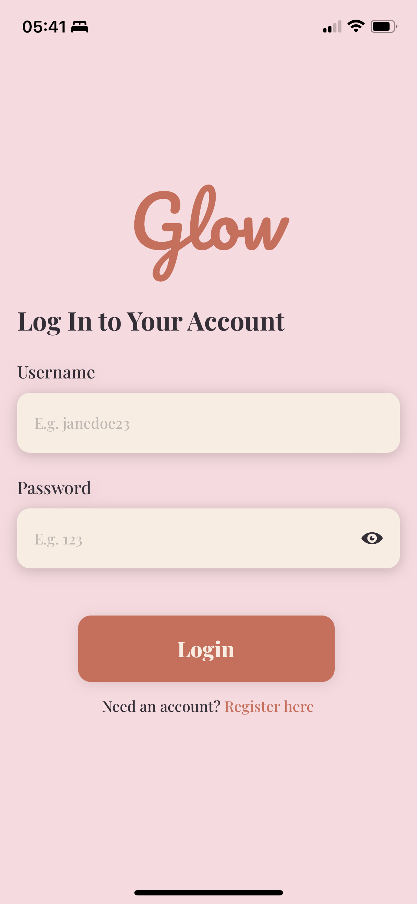
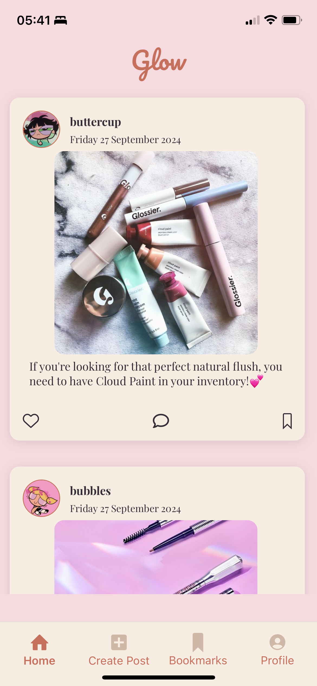
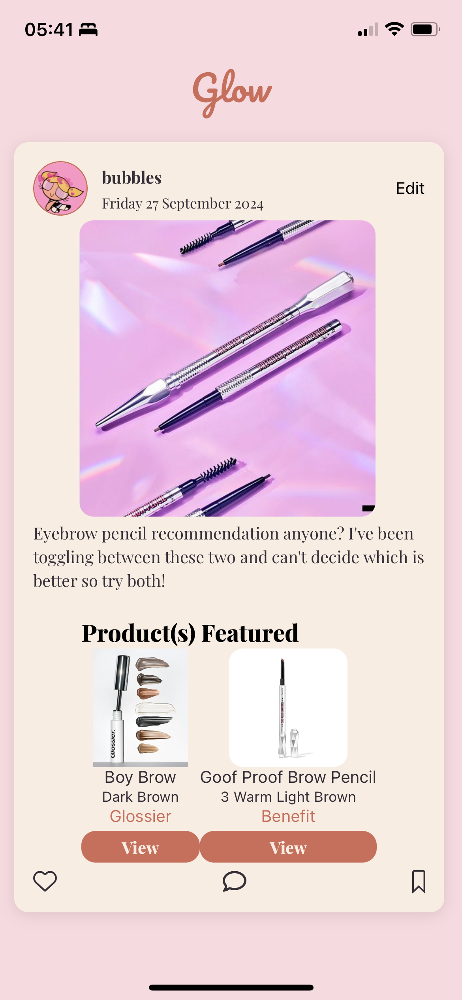
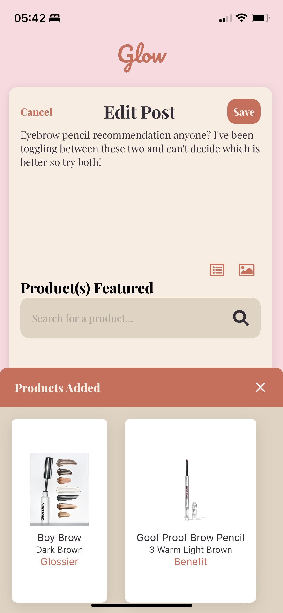
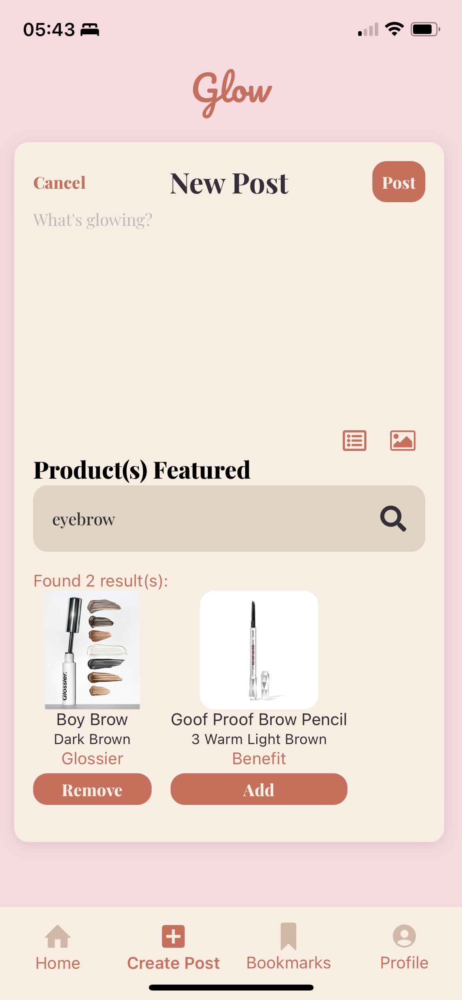

# Glow ✨

These days, many of us turn to social media to discover new products and communities that cater to our interests.

For the beauty and skincare industry, beauty influencers often share their makeup/skincare routine on popular platforms like Instagram or TikTok. 

In such platforms, they are often limited to only tagging the relevant beauty companies or only one single product in their post. Users who are interested in any product will often have to look up the company's site to locate it, and even then, they might not be able to find the exact one, especially if the products are from certain markets with a foreign language.

**Social Media, but for Makeup and Skincare**

Glow attempts to be a sort of social media serving the beauty and cosmetic industry, where users can not only share their makeup/skincare routine with their followers but also add those products to their posts.

This project was created in fulfillment of the final coding bootcamp project to build a full-stack app with at least one CRUD.

## Frameworks and Libraries

* [NativeWind](https://www.nativewind.dev/)
* [Expo](https://expo.dev/)

## Technologies Used
* MongoDB
* Express.js
* React Native
* Node.js

## Screenshots
*Main Screen*

*Login Screen*

*Home Feed*

*View Post*

*Edit Post*

*Create Post*

## Next Steps

* Build the user's profile page
* Enable users to search for each other and "follow"
* Add "Save Post" functionality
* Allow users to request products to be added if it is not in our database
* Allow users to report posts/accounts that violate community guidelines
* Grant moderator more permissions
* Build moderator UI
* Build the web and android UI